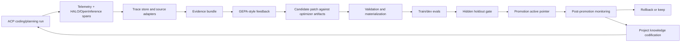

# BleedingAgent Competitive State Report

Date: 2026-05-01

Scope:

- Local codebase: `/Users/satan/side/experiments/supergemma-dflash-ddtree-mlx`
- Branch: `master`
- Local target: BleedingAgent, launched as `bag`, primarily an ACP coding-agent backend plus trace, evaluation, and self-optimization harness.
- Competitors: Codex CLI, ForgeCode, Pi, Oh My Pi, OpenCode. Aider and HALO are included as reference systems because they directly inform edit-format evaluation and trace-driven harness optimization.

Validation status:

- Current release-evidence verification on 2026-05-01 includes `npm run build`, `npm run acp:verify-consumers -- --timeout-ms 45000 --out .bag/acp-consumer-fixtures/local-consumer-validation-latest.json`, `bun test tests/release-rollup.test.ts` with 1 test and 20 assertions, and a targeted replay/edit/tool/provider/GEPA/orchestration suite with 78 tests and 440 assertions.
- Latest full local verification after this report refresh passed `npm run typecheck` and `npm test` with 307 tests, 0 failures, and 2527 assertions across 53 files. Re-run both after any follow-on edits.
- External facts were refreshed on 2026-05-01 from official docs, READMEs, and product pages. Exact star/fork counts are omitted because those are time-sensitive and not needed for the release claim.

## Release Evidence Status Refresh

This refresh is limited to the local release-readiness lane. It does not change the strategic competitor assessment below.

Current local status:

- BleedingAgent is best framed as an ACP self-evolving harness v0.1 candidate, not a CLI-first coding-agent UI.
- ACP runtime, session modes, YOLO/Safe, slash commands, trace/metrics commands, cancellation handling, and hidden maintenance inspections are implemented and covered by local fake-client transcript tests plus local named launch-target validation for Glass/Zed-compatible configuration.
- Live ACP coding can read, resolve a policy-backed edit strategy, render the selected edit contract, parse/apply model edit payloads, write final content through ACP, verify, repair, rollback, and persist traces.
- The edit strategy portfolio is now partly live: whole-file, exact replace, unified diff, apply patch, and hash/range exist with apply/eval/router/promotion coverage, plus live routing hooks. The final ACP write transport is still full-file `writeTextFile`, and broad real-model evidence is thin.
- MCP status is mixed: `/mcp` exposes attached ACP server metadata, and `src/mcp/runtime-tools.ts` has tested normalization, side-effect policy, runtime bridge, result bounding, tracing, and optimizer feedback helpers. Arbitrary ACP-attached MCP tools are still not generally proxied into the live model loop.
- Replay eval status is now a real offline substrate: live ACP captures can be redacted into optimizer-safe replay cases, holdout/raw-local leakage is blocked, and baseline/candidate scorecards run offline. Large-scale automatic harvesting and oracle strengthening are still follow-on operations work.
- GEPA closed-loop status is now operator-safe primitives rather than pure scaffold: readiness gates, feedback bundling, candidate generation, scoped validation, train/dev/holdout eval gates, promotion active pointers, checkpoints, post-promotion regression detection, and rollback primitives are implemented and tested. Silent autonomous scheduling/promotion remains intentionally unclaimed.
- Parallel orchestration now has a real contract/evidence substrate with lane ownership, conflict detection, isolation selection, concurrency policy, merge verification planning, and optimizer evidence conversion. Real ACP-launched parallel model workers remain future productization.
- Profile and knowledge automation have tested substrates, but automatic always-on lifecycle updates are not closed.

Release-readiness docs for this refresh:

- `docs/bleeding-agent-release-readiness.md`
- `docs/bleeding-agent-operator-runbook.md`

## Executive Summary

BleedingAgent should not be judged as "yet another terminal coding agent." That would put it directly against Codex CLI, ForgeCode, Pi, Oh My Pi, and OpenCode on a surface they already do better: polished CLI/TUI/desktop UX, broad tool suites, LSP/browser/subagent maturity, provider management, session management, and years of real user pressure.

The actual thesis is narrower and more valuable: BleedingAgent is a self-evolving coding-agent harness. Its job is to run through ACP, observe its own failures, turn traces into evidence, propose bounded changes to prompts/tool contracts/edit policies/verification policy, evaluate them on the current codebase and model, promote only what passes, then keep monitoring and rolling back when the promoted harness regresses.

Current engineering judgment:

| Target | Current state | Why |
| --- | ---: | --- |
| Daily-driver coding-agent product versus Codex/OpenCode/Forge/Oh My Pi | early/basic, not replacement-grade | It can read, edit, verify, trace, repair, and route model-facing edit strategies, but MCP execution is incomplete, ACP compatibility is not deeply hardened, real-model edit evidence is thin, and the user surface is intentionally minimal. |
| ACP backend plus harness v0.1 | credible operator-facing v0.1, not hardened daily-driver product | ACP server, modes, YOLO/Safe, slash commands, traces, evals, edit-strategy infra, source adapters, registry, replay redaction/extraction, candidate validation, GEPA gates, promotion, rollback, parallel orchestration substrate, local launch-target validation, and tests exist. |
| Self-evolving closed loop | operator-safe primitives complete enough for controlled use | Feedback, replay, candidate generation, validation, train/dev/holdout gates, promotion pointers, checkpoints, regression detection, and rollback primitives exist. The loop is not yet a silent daemon over a large live corpus. |
| Per-model/per-codebase specialization | partial scaffold | Profiles, policies, lineage, live edit policy routing, and active pointer resolution exist. Larger real replay corpora and optimizer scheduling still need work. |

The biggest issue has narrowed. The optimizer-aware edit infrastructure is now wired into the live
ACP coding loop at the model-facing contract/apply layer, and the release has a real evidence
substrate for replay, GEPA operations, and orchestration. It is still not proven by enough real ACP
consumer/model traces. The final ACP transport write is still full-file `writeTextFile`, arbitrary
ACP-attached MCP tools are not yet first-class live runtime tools, and the self-optimization loop is
not yet a silent daemon over a large live replay corpus with automatic promotion.

The strategic opportunity is real: most competitors publicly expose strong coding agents, not an inspectable per-codebase optimizer. BleedingAgent can win only if we make the optimizer loop the product primitive and let ACP clients provide the frontend.

## Sources And Methodology

Local research used the requested `$codebase-deep-research` frame:

- mapped repo boundary and branch;
- read manifests, docs, source, tests, and prior research docs;
- traced ACP prompt routing, edit/write/verify flow, telemetry, eval harness, optimizer registry, GEPA feedback, candidate generation, promotion, rollback, knowledge store, and source adapters;
- distinguished code that is live from code that is scaffolded/tested but not yet in the runtime path.

External research used the requested `$github-deep-research` frame:

- official docs and GitHub READMEs/pages first;
- product posts only where directly relevant;
- time-sensitive metrics marked as such;
- unknown internals marked as unknown instead of credited.

Primary external sources:

- Codex repo: <https://github.com/openai/codex>
- Codex skills docs: <https://developers.openai.com/codex/skills>
- Codex MCP docs: <https://developers.openai.com/codex/mcp>
- ForgeCode repo: <https://github.com/tailcallhq/forgecode>
- ForgeCode GPT-5.4 harness post: <https://forgecode.dev/blog/gpt-5-4-agent-improvements/>
- Pi repo: <https://github.com/badlogic/pi-mono>
- Oh My Pi repo: <https://github.com/can1357/oh-my-pi>
- OpenCode repo: <https://github.com/anomalyco/opencode>
- OpenCode ACP docs: <https://opencode.ai/docs/acp/>
- OpenCode tools docs: <https://opencode.ai/docs/tools/>
- OpenCode agents docs: <https://opencode.ai/docs/agents/>
- OpenCode MCP docs: <https://opencode.ai/docs/mcp-servers/>
- OpenCode permissions docs: <https://opencode.ai/docs/permissions/>
- OpenCode LSP docs: <https://opencode.ai/docs/lsp/>
- ACP introduction: <https://agentclientprotocol.com/get-started/introduction>
- Zed ACP page: <https://zed.dev/acp>
- Aider leaderboards: <https://aider.chat/docs/leaderboards/>
- Aider edit formats: <https://aider.chat/docs/more/edit-formats.html>
- HALO repo: <https://github.com/context-labs/halo>

Confidence levels:

- High: local source code, local tests, official docs, GitHub pages.
- Medium: public product posts and benchmark pages.
- Low/unknown: competitor internals that are not documented publicly.

## 2026-05-01 Source-Backed Competitor Refresh

| System | Current public surface | What it has that BleedingAgent should not try to reimplement first | Self-evolving harness evidence visible publicly |
| --- | --- | --- | --- |
| Codex CLI/App/IDE | Official docs and README describe a local terminal coding agent, editor/app/web surfaces, MCP, skills, AGENTS.md, plugins, subagents, GitHub/Slack/Linear integrations, non-interactive mode, SDK/app server/MCP server automation, and managed security/approval concepts. | Mature OpenAI product surface, account integration, IDE/app/web continuity, MCP and skills ecosystem, security/admin workflows. | Strong evals/observability likely internally, but public docs focus on product operation rather than a per-codebase optimizer that emits inspectable policy artifacts. |
| ForgeCode | README and docs describe a terminal development environment with TUI, one-shot CLI, ZSH `:` workflow, agents, conversations, git tooling, skills, semantic workspace search, MCP, provider config, shell tooling, and workspace indexing. | Rich terminal workflow, built-in agent roles, skills, conversation management, semantic indexing, MCP operations, provider UX. | Public GPT-5.4 post is highly aligned with our thesis: model-specific schema shape, truncation wording, and enforced verification materially change results. It does not expose an automatic GEPA-style local optimizer artifact loop in the docs reviewed. |
| Pi | README describes a minimal terminal coding harness with interactive/print/JSON/RPC/SDK modes, default read/write/edit/bash tools, provider subscriptions/API keys, sessions/branching/compaction, packages, skills, prompt templates, extensions, and deliberate minimal core philosophy. | Small hackable terminal harness, clean extension/package story, JSON/RPC/SDK integration, session sharing/data flywheel. | Pi explicitly encourages publishing real OSS sessions to improve agents, models, prompts, tools, and evals. It does not present the same built-in per-codebase optimizer/promotion loop in the README reviewed. |
| Oh My Pi | README describes a feature-rich Pi fork with commit tooling, persistent Python kernel, LSP operations, subagents/background jobs, model roles, todos, custom commands, universal config discovery, MCP/plugin system, browser/search/SSH tools, Hashline edits, native engine, stats, and many TUI features. | Very broad daily-driver feature surface: LSP, browser, plugins, subagents, background jobs, model roles, commit automation, Hashline edit mechanism, rich TUI. | Hashline and stats are directly relevant to edit/tool reliability, but the public README reads as a feature-rich agent product, not an inspectable GEPA-style optimizer harness that continuously proposes/promotes policy artifacts per codebase. |
| OpenCode | Docs describe TUI/CLI/web/IDE/ACP usage, built-in tools, custom tools, MCP servers, permissions, agents/subagents, skills, and LSP server integration. The ACP docs explicitly run `opencode acp` as an ACP-compatible subprocess over stdio. | Strongest direct ACP peer among the reviewed systems: broad tool set, permissions, agents, MCP, LSP, multiple consumers. | Public docs reviewed focus on capabilities and configuration. They do not expose an autonomous per-model/per-codebase optimizer artifact loop comparable to BleedingAgent's target. |

Implication: BleedingAgent should not compete by chasing every daily-driver feature in these tools. The release claim should stay on the harness layer: trace everything, convert real failures to replay/eval evidence, optimize tool/edit/prompt/verification policy per `(model, codebase, client)`, promote only through gates, and make rollback visible.

## What "Self-Evolving Coding Agent" Means

For this project, self-evolving does not mean an LLM freely rewrites its own source code. It means a controlled harness loop:

The optimized artifact is not "the model." It is the full harness policy for a specific `(model, codebase, toolset, ACP client, runtime)` tuple:

- model profile: context window, output limit, structured-output mode, prompt style, tool-calling behavior, local/openai-compatible endpoint;
- codebase profile: root fingerprint, languages, package managers, source roots, protected paths, verification commands, conventions;
- model-codebase policy: active tool versions, rendered tool versions, edit strategy version, fallback policy, repair policy, verifier policy, risk tolerance, concurrency limits, promotion gates;
- rendered tool contracts: names, descriptions, schema shape, examples, result style, prompt fragments, truncation wording;
- rendered edit contracts: whole-file, exact replace, unified diff, apply patch, hash/range, and later other families;
- eval suite: generated from real failures plus curated fixtures, with train/dev visible and holdout protected;
- knowledge memory: project facts, conventions, commands, gotchas, accepted user corrections, and prior decisions;
- runtime settings: YOLO/Safe, ACP client behavior, local executor concurrency, local model throughput and context behavior.

That means BleedingAgent should become different in every codebase. A TS/Rspack repo on local Qwen with flaky typecheck and Glass ACP needs a different active policy than a Rust repo with Codex master model, Zed ACP, and strong unit tests. This is the core product, not an incidental config feature.

## Lifecycle Depth Map

| Stage | What good looks like | BleedingAgent status | Evidence | Main gap |
| --- | --- | --- | --- | --- |
| Observe | Every model, tool, edit, command, verification, and repair step is traced with lineage. | Strong. | `src/telemetry.ts:14-38`, `src/telemetry.ts:75-309` | Need more live traces from real ACP usage. |
| Normalize | Native, ACP, Codex, Pi, and future sources become canonical spans without loosening the core trace shape. | Good substrate. | `src/source-adapters/canonical.ts:72-88`, `src/source-adapters/canonical.ts:221-230` | OpenCode/Forge adapters not implemented. |
| Diagnose | Failures are clustered by model/profile/policy/tool/edit strategy, not just by stack trace. | Good substrate. | `src/trace-analysis.ts`, `src/self-optimize.ts:120-176`, `src/replay/dataset.ts` | Need richer systemic diagnosis over a larger real ACP corpus. |
| Turn into feedback | Eval, trace, edit ablation, test output, truncation, and critique signals become bounded feedback records. | Strong operator-safe substrate. | `src/optimizer/gepa-feedback.ts:13-41`, `src/optimizer/gepa-feedback.ts:85-106`, `src/optimizer/gepa-operations.ts` | Needs live scheduling and richer real failure corpus. |
| Propose candidate | Propose changes only to optimizer artifacts, not arbitrary source. | Implemented conservatively. | `src/optimizer/candidates.ts:49-98`, `src/optimizer/types.ts:106-224` | Default proposer is deterministic; LLM proposer path is injectable but not productized. |
| Validate scope | Reject unsafe patches, wrong paths, missing base hashes, secret-like values, missing gates. | Implemented/tested. | `src/optimizer/validator.ts` | Need production UX around failed validations. |
| Evaluate | Compare baseline vs candidate on train/dev; keep holdout clean. | Real offline substrate. | `src/eval-harness/edit-strategy-ablation.ts:50-82`, `src/optimizer/edit-promotion-gates.ts:153-203`, `src/replay/dataset.ts` | Need a larger corpus of real ACP sessions and stronger task oracles. |
| Promote | Update active pointer only after validation and eval gates pass. | Implemented/tested. | `src/optimizer/promotion.ts:49-111` | Needs more operator UX around promotion failures and live acceptance checks. |
| Monitor | New sessions pin the promoted policy; regressions are attributed back to the policy. | Partial plus tested regression budget primitives. | `src/telemetry.ts:14-38`, `src/optimizer/policy-resolver.ts`, `src/optimizer/gepa-operations.ts` | Silent automatic rollback trigger is intentionally not claimed. |
| Roll back | Previous active pointer can be restored from checkpoint. | Implemented. | `src/optimizer/promotion.ts:113-126` | Needs automatic post-promotion rollback policy. |
| Codify knowledge | Durable project learnings are separated from optimizer policy and injected as untrusted memory. | Implemented substrate. | `src/knowledge/store.ts:44-69`, `src/knowledge/injection.ts:130-143` | Need automatic extraction from successful/failed work to project memory. |

The local architecture is directionally right. The missing part is not conceptual; it is wiring and operational closure.

## Local Implementation Inventory

### 1. ACP Runtime

Implemented:

- `bag acp` starts an ACP stdio server.
- Modes exist: Auto, Chat, Plan, Run.
- YOLO mode is represented as a session config option and is default when policy does not require approvals.
- Safe mode can request ACP permissions for edits/commands.
- Slash commands exist for normal use and maintenance use.
- Auto routing is semantic/model-driven and explicitly avoids language keyword rules.
- Temporary Auto routes restore Auto afterward.

Evidence:

- ACP facade and protocol wiring: `src/acp-agent.ts`
- Mode definitions, commands, and consumer-facing surface metadata: `src/acp/surface.ts`
- YOLO/Safe session config and temporary Auto restoration: `src/acp/session.ts`
- Semantic route prompt and route restoration: `src/acp/prompt-router.ts`
- Slash command dispatch: `src/acp/slash-router.ts`
- Coding turn orchestration: `src/acp/coding-runner.ts`

Assessment:

- Good ACP backend skeleton.
- The previous bad behavior where a greeting caused project exploration was addressed by routing and mode semantics.
- It still needs broader compatibility testing against Glass, Zed, JetBrains, Avante, and CodeCompanion.

### 2. Live Coding Flow

Implemented flow:

1. Load project knowledge.
2. Scout candidate files.
3. Build codebase context.
4. Select files.
5. Read selected files through ACP/local fallback.
6. Ask the model for a patch object.
7. Preview the edit locally.
8. Emit ACP diff.
9. Write through ACP/local fallback.
10. Run verification commands.
11. Repair up to two times.
12. Persist artifacts, trace, edit results, command results, self-eval, optimization report, and manifest.

Important boundary:

- The live model-facing edit contract is selected by the policy/router and rendered per strategy.
- The final ACP client write still sends full file contents through `writeTextFile`, because ACP file writes are whole-file writes in this implementation.
- The deterministic release dogfood exercises the whole-file write-boundary path; broader real-model coverage for exact-replace, unified-diff, apply-patch, and hash/range is still needed.

Evidence:

- Live edit context resolution and routing: `src/acp/edit-routing.ts`
- Rendered edit contract prompting and `EditApplyInputSchema` parsing: `src/acp/coding-generation.ts`
- Coding turn orchestration, fallback, repair, verification, and rollback loop: `src/acp/coding-runner.ts`
- Deterministic preview/apply/write lifecycle: `src/acp/edit-lifecycle.ts`
- Final ACP write boundary: `writeClientFileWithPermission` in `src/acp/workspace-io.ts`

Assessment:

- This is a real but basic coding agent.
- It now has the core optimizer-aware edit loop, but it lacks enough live trace volume to know which edit strategy works best per model/codebase.
- The highest-priority remaining gap is evidence closure: real sessions must become replay evals, and edit/tool failures must feed candidate generation and promotion.

### 3. Edit Strategy Portfolio

Implemented:

- Families: `whole_file`, `exact_replace`, `unified_diff`, `apply_patch`, `hash_range`.
- Protected-path checks.
- Hash mismatch/stale checks.
- Exact-match-not-found and exact-match-ambiguous failures.
- Range-out-of-bounds and scope violations.
- Preview diffs and deterministic apply results.
- Ablation reports with train/dev by default and explicit holdout guard.
- Router uses historical metrics from traces, ablations, or manual data.
- Router penalizes protected-path touches, stale rejections, and applied-but-broken outcomes.
- Promotion gates include train/dev, holdout, leakage, protected path, post-apply consistency, latency, and token/cost checks.

Evidence:

- Apply families: `src/edit-strategy/apply-layer.ts:67-118`
- Whole-file/exact/hash implementations: `src/edit-strategy/apply-layer.ts:182-275`
- Ablation split guard and metrics: `src/eval-harness/edit-strategy-ablation.ts:50-154`
- Router schema and ranking: `src/optimizer/edit-policy-router.ts:26-154`, `src/optimizer/edit-policy-router.ts:176-230`
- Promotion gates: `src/optimizer/edit-promotion-gates.ts:36-44`, `src/optimizer/edit-promotion-gates.ts:92-151`

Assessment:

- This is one of the strongest architectural pieces.
- It directly matches the Aider evidence that edit format is model-sensitive and our own requirement not to pick one global edit winner.
- It has live routing hooks now, but must be proven through real ACP/model traces before any edit strategy is treated as the winner for a model/codebase.

### 4. Telemetry, Traces, And Applied-But-Broken Failures

Implemented:

- Step spans, LLM spans, tool metrics, edit attempts, token counts, durations, errors.
- Optimizer session pin dimensions: model profile, codebase profile, policy, tool versions, edit versions.
- Edit health classification catches not only parse/apply failures, but also verification failure, inconsistent post-apply state, self-detected regression, rollback failure/partial, protected path touch, stale context, and permission failures.

Evidence:

- Optimizer lineage fields: `src/telemetry.ts:14-38`
- LLM/tool/edit recording: `src/telemetry.ts:192-309`
- Applied-but-broken classification: `src/telemetry.ts:559-590`

Assessment:

- This is stronger than many public agent products expose.
- The key is not just logging; it is logging with optimizer dimensions.
- The system can represent "the edit applied but the file/codebase is now broken," which is essential for learning edit policies.

### 5. Optimizer Registry And Policy Model

Implemented:

- Record kinds: model profile, codebase profile, model-codebase policy, canonical tool spec, rendered tool contract, candidate patch, eval result, promotion decision.
- Model profiles include provider, model, context/output limits, tool-calling/structured-output mode, prompt style, result style, verification policy.
- Codebase profiles include root fingerprint, languages, package managers, source roots, test/typecheck/lint commands, protected paths, conventions.
- Model-codebase policies pin canonical/rendered tool versions, result style, verification policy, edit strategy, edit contract, fallback, repair, verifier, objective set, candidate scopes, gates, concurrency, risk tolerance.
- Candidate scopes restrict what JSON pointers can be changed.

Evidence:

- Registry kinds: `src/optimizer/types.ts:23-32`
- Model profile: `src/optimizer/types.ts:61-78`
- Codebase profile: `src/optimizer/types.ts:90-103`
- Policy: `src/optimizer/types.ts:123-142`
- Tool/rendered contract schemas: `src/optimizer/types.ts:148-187`
- Candidate patch schema: `src/optimizer/types.ts:214-224`

Assessment:

- This is the main differentiator.
- Competitors may have internal equivalents, but BleedingAgent exposes the dimensions as versioned artifacts that can be evaluated, promoted, and rolled back.

### 6. GEPA-Style Feedback And Candidate Generation

Implemented:

- Feedback records can come from eval runs, scorecards, trace evidence, edit ablations, test output, truncation mistakes, and LLM critique.
- Feedback is redacted/truncated before optimizer use.
- Candidate generator maps tool failures to rendered tool contract guidance, eval failures to gates, trace failures to reliability gates, edit failures to edit contract/policy updates.
- GEPA runner is bounded by iteration, feedback, candidate, and total candidate caps.
- Proposer is injectable; default proposer is deterministic.

Evidence:

- Feedback schema/source types: `src/optimizer/gepa-feedback.ts:13-41`
- Feedback bundle construction: `src/optimizer/gepa-feedback.ts:85-106`
- Edit-ablation feedback objective: `src/optimizer/gepa-feedback.ts:224-264`
- Candidate mappings: `src/optimizer/candidates.ts:100-315`
- GEPA runner loop: `src/optimizer/gepa-runner.ts:101-227`
- Default proposer: `src/optimizer/gepa-runner.ts:229-234`

Assessment:

- The GEPA-style substrate now has operator-safe readiness, candidate, eval-gate, promotion, checkpoint, regression, and rollback primitives.
- It is not yet a silent autonomous optimizer because model-backed proposer orchestration, continuous scheduling, and automatic promotion are not productized.

### 7. Eval And Holdout Discipline

Implemented:

- Temp workspace eval runner.
- Edit strategy ablation over visible train/dev by default.
- Holdout can be used only explicitly.
- Holdout leakage is a promotion blocker.
- Promotion requires visible train/dev, hidden holdout, protected-path veto, post-apply consistency veto, latency/cost gates.

Evidence:

- Ablation defaults and holdout guard: `src/eval-harness/edit-strategy-ablation.ts:50-82`
- Probe result tracks parse/apply/verification/post-apply/self-regression/protected status: `src/eval-harness/edit-strategy-ablation.ts:85-109`
- Promotion gates: `src/optimizer/edit-promotion-gates.ts:153-238`

Assessment:

- Strong for avoiding prompt overfit.
- Real replay extraction exists, but it still needs a larger real ACP corpus and stronger oracles before strong promotion claims are defensible.

### 8. Knowledge Store

Implemented:

- `.bag/knowledge/entries.jsonl`
- `.bag/knowledge/consolidation-groups.jsonl`
- generated `.bag/knowledge/AI.md`
- entry types for commands, conventions, gotchas, decisions, facts, accepted user corrections.
- prompt injection that explicitly treats knowledge as untrusted memory, not system/developer/tool/optimizer policy.

Evidence:

- Store paths: `src/knowledge/store.ts:44-69`
- Summary sections: `src/knowledge/store.ts:189-260`
- Injection boundary: `src/knowledge/injection.ts:130-143`

Assessment:

- Correct separation: project memory helps task quality, optimizer profiles help harness reliability.
- Needs automatic codification from successful runs, failed runs, reviews, and user corrections.

### 9. MCP And Skills

Implemented:

- ACP session can show attached MCP servers.
- `/mcp` and `/skills` exist.
- Tool specs can represent side-effect level and confirmation requirements.
- MCP metadata can be normalized into canonical optimizer tool specs.
- Rendered MCP contracts, side-effect policy, runtime execution bridge, result bounding, trace output, and optimizer feedback helpers are implemented and tested offline.

Missing:

- Arbitrary ACP-attached MCP tools are not yet generally proxied into the live model loop.
- Live ACP coding runs do not yet choose and execute MCP tools as first-class model-visible runtime tools.
- Skills are discoverable but not compiled into optimizer-aware tool/plan contracts.

Assessment:

- Discovery and tested runtime substrate exist.
- Live ACP model-loop integration is missing.

## Competitor Product Comparison

Legend:

- `5`: mature public shipping capability with docs/evidence.
- `4`: strong public capability but not obviously complete for our exact goal.
- `3`: partial or product-specific capability.
- `2`: infrastructure or limited implementation.
- `1`: minimal/planned.
- `0`: no public evidence.
- `?`: likely internal or unknown; not credited.

| Capability | BleedingAgent | Codex CLI | ForgeCode | Pi | Oh My Pi | OpenCode |
| --- | ---: | ---: | ---: | ---: | ---: | ---: |
| Finished coding-agent UX | 2 | 5 | 4 | 4 | 4 | 5 |
| ACP-first frontend boundary | 3 | 2 | 0 | 1 | 0 | 5 |
| File read/edit/terminal loop | 3 | 5 | 5 | 4 | 5 | 5 |
| Mature permissions/YOLO/Safe UX | 3 | 5 | 4 | 3 | 4 | 5 |
| Slash commands | 3 | 5 | 4 | 4 | 5 | 5 |
| MCP live tool execution | 1 | 5 | 4 | 3 | 4 | 5 |
| LSP | 0 future-gated | ? | ? | ? | 5 | 5 |
| Browser/computer automation | 0 future-gated | 4 product-dependent | ? | ? | 5 | ? |
| Subagents/background jobs | 1 | 4 | 3 | 3 | 5 | 5 |
| Session management/branching/compaction | 1 | 4 | 4 | 3 | 5 | 4 |
| Local model/provider breadth | 3 | 3 | 5 | 5 | 5 | 5 |
| Semantic/codebase search | 2 | 4 | 4 | 3 | 4 | 4 |
| Install/package maturity | 2 | 5 | 5 | 4 | 4 | 5 |

On normal coding-agent product maturity, BleedingAgent loses today. That is acceptable only if we execute the harness/optimizer strategy.

## Self-Evolving Harness Comparison

This is the matrix that matters more for our project.

| Harness capability | BleedingAgent | Codex CLI | ForgeCode | Pi | Oh My Pi | OpenCode | HALO reference |
| --- | ---: | ---: | ---: | ---: | ---: | ---: | ---: |
| Explicit model profile artifact | 4 | ? | 3 | 3 | 4 | 3 | 3 |
| Explicit codebase profile artifact | 4 | 2 via rules | 2 | 2 | 3 | 2 | 3 |
| Explicit model-codebase policy | 4 | ? | ? | ? | ? | ? | 2 |
| Versioned canonical tool spec | 4 | ? | 3 | 3 | 3 | 4 | 3 |
| Versioned rendered tool contract | 4 | ? | 2 | ? | ? | ? | 3 |
| Tool schema/result wording as optimizer target | 4 | ? | 4 public lesson | ? | 3 inferred | ? | 4 |
| Edit strategy portfolio | 4 infra, 3 partly live | ? | 3 | ? | 5 Hashline/tools | 4 | 1 |
| Edit strategy learned per model/codebase | 3 infra and gates | ? | 2 manual | ? | ? | ? | 0 |
| Applied-but-broken edit tracking | 4 | ? | 3 lesson | ? | ? | ? | 3 |
| HALO/OpenInference-like trace spans | 4 | ? | ? | ? | ? | ? | 5 |
| Trace lineage includes model/codebase/policy/tool/edit versions | 4 | ? | ? | ? | ? | ? | 4 |
| Source adapters for other agents | 3 | 0 | 0 | 0 | ? | 0 | 2 |
| Eval harness with train/dev/holdout | 4 plus replay adapter | ? internal | 3 public eval culture | 2 session data direction | 2 benchmark claims | ? | 3 |
| Candidate patches scoped to optimizer artifacts | 4 | 0 public | 0 public | 0 public | 0 public | 0 public | 3 |
| Promotion active pointer | 4 | ? | ? | ? | ? | ? | 2 |
| Rollback checkpoint | 4 | ? | ? | ? | ? | ? | 2 |
| Autonomous closed-loop optimizer | 3 operator-safe, not daemon | ? internal | 1 manual engineering | 1 data flywheel | ? | ? | 4 |
| Project knowledge codification | 3 | 4 skills/rules/memory | 3 skills | 3 toolkit | 4 memory/TTSR | 4 rules/skills | 2 |
| Post-promotion monitoring | 3 tested budget, not automatic rollback | ? | ? | ? | ? | ? | 4 |

Interpretation:

- BleedingAgent already has unusually explicit optimizer artifacts.
- HALO is stronger as a trace-optimizer reference, but it is not a full coding agent and is Python/DSPy-based.
- ForgeCode is the strongest public validation of the thesis that model-specific harness details matter.
- Aider is the strongest public validation that edit formats are model-sensitive.
- OpenCode is the strongest ACP product benchmark.
- Oh My Pi is the richest model-facing tool/edit runtime benchmark.

## Competitor Deep Notes

### Codex CLI

Public state:

- Repo: <https://github.com/openai/codex>
- GitHub page describes it as a local coding agent and shows npm/Homebrew install paths.
- Public Codex docs expose a broad product surface: CLI, IDE, app/cloud, AGENTS.md/rules, skills, MCP, subagents, workflows, sandboxing, automation, and integrations.
- Codex skills docs describe skills as packaged instructions/resources/scripts for reusable workflows, available in CLI, IDE extension, and app.
- Codex MCP docs say MCP gives Codex access to third-party tools and context in CLI and IDE.

Strengths over BleedingAgent:

- Much more mature product.
- Better install/distribution.
- Stronger model access.
- Mature rules/skills/MCP ecosystem.
- Stronger security/approval/sandbox story.
- More real-world usage feedback.

What is not public:

- No public per-codebase optimizer registry.
- No public active-pointer promotion model for prompt/tool/edit policies.
- No public trace-to-candidate-to-holdout promotion loop.

What to learn:

- Skills/rules must stay focused and testable.
- MCP and AGENTS.md integration must be first-class.
- The user should not need to understand optimizer internals during normal coding.

Strategic read:

- Codex wins as a finished product.
- BleedingAgent must not chase a Codex-like CLI. It must become a better local/per-codebase optimizer layer that can use local models and ACP frontends.

### ForgeCode

Public state:

- Repo: <https://github.com/tailcallhq/forgecode>
- GitHub page describes a terminal AI development environment with TUI, one-shot CLI, and ZSH `:` prefix workflow.
- It supports provider/model configuration, tool timeouts, debug request dumps, skills, MCP configuration, semantic workspace search, shell integration, and conversation management.
- The ForgeCode GPT-5.4 post is directly relevant: it reports that field ordering, schema flattening, explicit truncation wording, and enforced verification materially changed tool reliability for GPT-5.4 versus Opus 4.6.

Strengths over BleedingAgent:

- More mature terminal workflow.
- Better model/provider ergonomics.
- Semantic workspace search.
- Meaningful MCP management.
- Strong public engineering culture around harness failures.
- Practical evidence that verification must be enforced by runtime, not merely prompted.

What is not public:

- No public autonomous per-codebase optimizer artifact registry.
- The GPT-5.4 improvements appear engineering-led/manual, not a closed self-optimizing loop.
- No ACP-first product direction.

What to learn:

- Tool schema shape is an optimization target.
- Tool result wording is an optimization target.
- Truncation visibility is an optimization target.
- Verification enforcement is an optimization target.
- These optimizations differ by model and probably by codebase.

Strategic read:

- Forge validates our entire premise. It shows that "same model, same task" can fail or pass because of harness details.
- We need to automate this class of improvement instead of manually rediscovering it per model.

### Pi

Public state:

- Repo: <https://github.com/badlogic/pi-mono>
- GitHub page describes an AI agent toolkit: coding CLI, unified LLM API, TUI/web UI libraries, Slack bot, and vLLM pods.
- GitHub page on 2026-05-01 showed about 43.2k stars, 5.1k forks, TypeScript majority, MIT license, latest release v0.70.6 on 2026-04-28.

Strengths over BleedingAgent:

- Broader toolkit.
- Unified LLM API.
- Reusable UI libraries.
- More ecosystem-like package surface.
- Better base for session/data sharing and real-world trace collection.

What is not public:

- No clear public equivalent of a GEPA/HALO-style per-codebase optimizer loop.
- No public active policy promotion/rollback model.

What to learn:

- Real-session data is a competitive asset.
- We should keep Pi source adapters and replay ingestion strong.
- A toolkit can feed the optimizer even if it is not our runtime.

Strategic read:

- Pi is ahead as a toolkit.
- BleedingAgent should use Pi-style traces and session data as possible optimizer input, not try to become Pi's TUI/web toolkit.

### Oh My Pi

Public state:

- Repo: <https://github.com/can1357/oh-my-pi>
- GitHub page describes a terminal coding agent with hash-anchored edits, optimized tool harness, LSP, Python, browser, subagents, and more.
- Public README lists LSP support across many languages, local LSP discovery, Time Traveling Streamed Rules, interactive review, task/subagent system, browser mode, MCP management, session branching, compaction, handoff, memory, provider/model config, llama.cpp/Ollama-style local endpoints, and canonical model IDs.

Strengths over BleedingAgent:

- Far richer model-facing tool suite.
- Strong live edit mechanism.
- LSP.
- Python/IPython-like tool direction.
- Browser automation.
- Subagents/background jobs.
- Session branching/compaction/handoff.
- Memory and stats surface.
- Custom providers/local models are clearly mature.

What is not public:

- No documented autonomous per-codebase optimizer loop with train/dev/holdout promotion and active pointer rollback.
- Hashline is a strong edit mechanism, but not proof that it is globally best for every current/future model/codebase.

What to learn:

- Hash/range anchored edits are important candidate strategies.
- Dynamic rule injection can be powerful, but in BleedingAgent it must be optimized/evaluated policy, not hardcoded language/intent keyword routing.
- Rich tools are useful only if we can measure where they help or fail.

Strategic read:

- Oh My Pi is far ahead as a power-user terminal agent.
- BleedingAgent should treat its edit/tool ideas as candidate families for measured optimization, not as defaults to copy blindly.

### OpenCode

Public state:

- Current repo: <https://github.com/anomalyco/opencode>
- GitHub page describes it as the open source AI coding agent.
- GitHub page on 2026-05-01 showed about 152k stars, 17.6k forks, MIT license, TypeScript majority, latest release v1.14.30 on 2026-04-29.
- README/docs describe terminal install, desktop beta, TUI focus, client/server architecture, agents, tools, permissions, LSP, MCP, commands, skills, and custom tools.
- ACP docs say `opencode acp` runs as an ACP subprocess over JSON-RPC stdio.
- ACP docs claim ACP mode supports built-in tools, custom tools/slash commands, MCP servers, AGENTS.md rules, formatters/linters, agents, and permissions, with some slash commands like undo/redo unsupported.

Strengths over BleedingAgent:

- Strongest direct ACP benchmark.
- Mature TUI and desktop beta.
- Strong tools/permissions/docs.
- First-class agents and subagents.
- LSP.
- MCP.
- Custom tools.
- Commands.
- Client/server architecture.

What is not public:

- No explicit public self-evolving optimizer registry.
- No public trace-to-candidate-to-holdout promotion loop.

What to learn:

- ACP should feel like the real frontend, not a degraded mode.
- Tool, permission, agent, MCP, rules, and formatter/linters must work through ACP.
- Maintenance/optimizer controls should exist but remain secondary to coding/planning UX.

Strategic read:

- OpenCode is the product bar for ACP compatibility.
- BleedingAgent can only be credible if ACP users get comparable core coding behavior in compatible
  clients, while we add the optimizer layer underneath.

### Aider Reference

Aider is not in the direct competitor set here, but it is critical evidence.

Public evidence:

- Aider leaderboards expose edit format as a measured variable.
- Aider docs include formats such as `whole`, `diff`, `diff-fenced`, `udiff`, and editor variants.
- The leaderboard shows well-formedness, malformed responses, lazy comments, syntax errors, and pass rates split by model and edit format.

What to learn:

- Edit format is not a philosophical choice.
- It is an empirical variable.
- Public leaderboard results are not enough to route our current local models; they are useful for taxonomy, fixture design, and metrics.

Strategic read:

- Our edit router must learn from local traces and evals for this model/codebase/task mix.
- We should not hardcode hash-based, diff-based, whole-file, or any other method as universally best.

### HALO Reference

HALO is not a coding-agent competitor. It is a trace-driven optimizer reference.

Public state:

- Repo: <https://github.com/context-labs/halo>
- GitHub page describes it as Hierarchal Agent Loop Optimizer.
- Repo is Python-majority and had no releases shown on the public page at the time of research.

What to learn:

- Optimize harnesses through traces, not vibes.
- Use bounded trace tools rather than dumping raw traces into a model.
- Look for recurring systemic failure modes, not one-off anecdotes.
- Feed reports/candidates into an eval loop.

Strategic read:

- BleedingAgent already adopted part of this with HALO/OpenInference-like spans, trace store, source adapters, feedback bundles, and GEPA-style runner.
- We still lack the full autonomous loop and dedicated trace-investigation agent.

## The Key Product Boundary

BleedingAgent is a coding agent, but not a CLI coding-agent product.

Target boundary:

- ACP clients provide chat/editor UI, multi-file review UX, diffs, permissions, and terminal surfaces.
- `bag acp` provides agent runtime, tool execution, traces, policies, self-eval, and optimizer hooks.
- `bag` CLI provides maintenance commands, diagnostics, benchmarking helpers, and operator workflows.
- Optimizer internals are visible to us, but normal users should mostly see coding, planning, metrics, and trace health.

This means exposing `optimize` through ACP is acceptable only if it is clearly a maintenance/admin action. The default user interface should remain:

- ask questions;
- plan;
- inspect project;
- edit files;
- run commands;
- verify;
- review traces/artifacts;
- toggle safe/yolo;
- inspect MCP/skills.

Optimization should usually run automatically or be triggered by us, not distract users during normal coding.

## What BleedingAgent Already Does Better

### Explicit Optimizer Dimensions

BleedingAgent logs and models:

- model profile id;
- codebase profile id;
- policy id;
- canonical tool version;
- rendered tool version;
- result style version;
- verification policy version;
- edit strategy version;
- rendered edit contract version;
- fallback/repair/verifier policy versions;
- edit objective set id.

This is the difference between "we have logs" and "we can attribute a regression to the exact policy that produced it."

### Bounded Self-Improvement Surface

Candidate patches target optimizer artifacts through allowed JSON pointers. The optimizer is not allowed to casually rewrite project source code.

That is the correct safety boundary:

- User-requested coding edits can mutate source.
- Self-improvement candidates mutate prompts/tool contracts/policy/eval artifacts.
- Promotion changes the active harness for future sessions.

### Edit Strategy As Policy

The design explicitly rejects a universal edit winner. It can compare whole-file, exact replace, unified diff, apply patch, hash/range, and later apply-model or AST/LSP variants.

This directly addresses the user's point: current research cannot tell us which edit tool works best with our local Qwen variant on this codebase. Only our traces and evals can.

### Applied-But-Broken Tracking

The system can mark edits that parse/apply/write successfully but later fail verification, post-apply consistency, or self-detected regression. This is one of the most important real failure classes for coding agents.

### Holdout Discipline

The harness has explicit train/dev/holdout handling. That matters because optimizers will otherwise overfit quickly to visible failure cases.

### Source Adapter Direction

Canonicalizing ACP/Codex/Pi/native spans means we can eventually learn from other agents' logs without coupling to their runtimes.

## What Competitors Still Clearly Do Better

### Live Coding Power

Codex, ForgeCode, Oh My Pi, and OpenCode are far ahead as daily coding tools. They have more tools, more provider polish, more UX, more real-world loops, and more edge-case hardening.

### ACP Completeness

OpenCode sets the bar. Its docs claim ACP mode supports built-in tools, custom tools/slash commands, MCP, AGENTS.md rules, formatters/linters, agents, and permissions. BleedingAgent does not yet expose comparable breadth.

### Tool Ecosystem

Oh My Pi and OpenCode both expose richer tool systems. Forge has better workspace/semantic search and shell workflow. Codex has the OpenAI skills/MCP/rules ecosystem.

### LSP

OpenCode and Oh My Pi are ahead. BleedingAgent intentionally does not implement LSP yet.

Explicit gate:

- Do not research or implement LSP now.
- Keep it as future work only after P0-P4 below are complete and the user explicitly approves.

### Browser Automation

Oh My Pi is ahead with browser automation. Codex product surfaces also include broader computer/browser tool directions.

Explicit gate:

- Do not research or implement browser/Camoufox/Patchright now.
- Keep it as future work only after the core edit/tool/optimizer loop is solved and the user explicitly approves.

### Real-World Corpus

Competitors have more real usage. BleedingAgent has good schemas/tests, but not enough real task traces yet.

## Critical Gaps

### Gap 1: Live Edit Portfolio Needs Real-Model Closure

Current runtime:

- active policy/router selects the model-facing edit strategy;
- rendered edit contracts are included in the live coding prompt;
- model payloads are parsed through `EditApplyInputSchema` and applied locally;
- final ACP writes still send full file contents;
- release dogfood covers the whole-file write-boundary path, not every strategy with real models.

Required:

- run real-model ACP sessions across whole-file, exact-replace, unified-diff, apply-patch, and hash/range;
- convert edit failures and applied-but-broken outcomes into replay eval cases;
- measure parse/apply/write/verify/repair/rollback/fallback phases per strategy and model;
- separate model-facing strategy lineage from ACP whole-file transport lineage in reports;
- feed failure evidence into GEPA and promotion gates.

This remains a high-priority milestone because the mechanism exists, but the per-model/per-codebase evidence does not.

### Gap 2: MCP Tools Are Not First-Class Runtime Tools

Current runtime:

- `/mcp` can show attached MCP metadata.
- MCP normalization, rendered contract preparation, side-effect classification, execution bridge, result bounding, trace records, and optimizer feedback helpers exist as tested substrate.

Required:

- wire ACP-attached MCP tools into the live model loop;
- select model-visible MCP contracts from active policy;
- execute calls through the runtime bridge;
- trace arguments/results/errors;
- optimize descriptions/schema/result wording/retry policy.

### Gap 3: Replay Evals From Real ACP Sessions

Current runtime:

- eval harness exists;
- source adapters exist;
- synthetic/curated fixtures exist.

Required:

- convert failed live ACP sessions into replayable eval cases;
- split into visible train/dev and hidden holdout;
- preserve redaction;
- make failed session -> eval fixture low-friction.

### Gap 4: Autonomous Optimizer Scheduling

Current runtime:

- `bag self-optimize` and GEPA primitives exist.
- maintenance commands exist.

Required:

- detect enough evidence;
- build feedback bundle;
- run GEPA with deterministic and LLM proposer modes;
- validate/materialize candidates;
- run evals;
- inspect gates;
- promote active pointer;
- monitor and rollback.

### Gap 5: ACP Compatibility Hardening

Required scenarios:

- greeting remains chat;
- "write me a codebase status report" routes read-only Plan;
- "fix this bug" routes Run;
- Auto returns to Auto after temporary route;
- YOLO runs without approval, Safe prompts;
- cancellation leaves trace/artifact state sane;
- Glass and Zed show tool calls understandably;
- terminal output is bounded but not misleading;
- permission failures are traced and optimizable.

### Gap 6: Project Profile Generation

Current:

- codebase profile schema exists.

Required:

- generate/update profile from repo fingerprint, package manager, language mix, commands, protected paths, conventions, prior failures;
- detect drift when dependencies/commands/layout change;
- keep profile changes eval-gated if they affect runtime policy.

## Priority Engineering Plan

### P0: Live Edit Portfolio

Goal:

- Prove and harden the live edit strategy portfolio under real models and real ACP sessions.

Work:

- Keep the live edit operation envelope, rendered edit contracts, router, `applyEdit` path, fallback, repair, rollback, and lifecycle telemetry in the runtime path.
- Add real-model dogfood cases for exact-replace, unified-diff, apply-patch, and hash/range.
- Record whether a failure happened in model output, parser, apply layer, ACP write transport, verification, repair, rollback, or post-apply consistency.
- Convert failures into replay evals with train/dev/holdout split discipline.
- Let GEPA propose bounded changes to strategy selection, contract rendering, fallback order, repair policy, and verifier policy.

Acceptance:

- Live ACP run evidence shows whole-file, exact-replace, apply-patch/unified-diff, and hash-range families can be exercised or explicitly rejected with measured reasons.
- Strategy choice is policy/evidence driven, not natural-language keyword driven.
- Applied-but-broken outcomes feed router risk and promotion gates.

### P1: MCP Runtime

Goal:

- MCP tools become model-visible, side-effect-classified, traced, and optimizable.

Work:

- Convert MCP metadata to canonical tool specs.
- Render model-specific tool contracts.
- Respect YOLO/Safe and side-effect class.
- Execute through ACP/runtime.
- Trace every call.
- Feed malformed args, bad descriptions, schema issues, retries, result-size problems, and permission failures into optimizer feedback.

Acceptance:

- A configured MCP server can be used by the model.
- Tool failures include policy/tool/rendered-contract lineage.

### P2: Real Replay Evals

Goal:

- Turn actual failures into eval cases without hand-rewriting the task from scratch.

Work:

- Persist ACP session events in replayable form.
- Add adapter from ACP session trace to eval case.
- Add scenario packs for greetings, report generation, mutation, tool args, truncation, verification, edit failures, repair loops, and permission modes.
- Ensure train/dev/holdout handling remains strict.

Acceptance:

- A failed live ACP session can become a replay fixture and feed GEPA feedback, including named
  consumer sessions where locally validated.

### P3: Close GEPA Loop

Goal:

- Run bounded optimizer iterations over real feedback and promote safe improvements.

Work:

- Add LLM-backed proposer behind maintenance/admin controls.
- Keep deterministic proposer as baseline.
- Validate candidate patch scopes and base hashes.
- Materialize candidate artifacts.
- Run baseline vs candidate evals.
- Gate promotion with train/dev and holdout.
- Promote active pointer for new sessions only.
- Monitor post-promotion traces.
- Roll back on regression.

Acceptance:

- `bag` can improve a rendered tool/edit/policy artifact for a specific model/codebase pair without editing project source.

### P4: ACP Product Polish

Goal:

- ACP clients feel like real coding frontends, not debug shells.

Work:

- Improve progress updates.
- Link artifacts/traces clearly.
- Harden cancellation/resume.
- Test the headless ACP harness first, then named consumers such as Glass and Zed; document setup and
  known limitations.
- Hide maintenance commands from normal command surface while keeping them available.

Acceptance:

- Normal coding/planning interactions are understandable without reading optimizer docs.

### P5: Project Knowledge And Profile Automation

Goal:

- Convert repeated project facts and user corrections into durable, bounded project memory and profile deltas.

Work:

- Codify successful/failed work into `.bag/knowledge`.
- Dedupe and consolidate.
- Generate/update codebase profiles from repo facts and traces.
- Inject memory as untrusted context.
- Keep optimizer policy separate.

Acceptance:

- The agent gets better at this repo's conventions without mixing memory into system/tool policy.

### P6: Future-Gated LSP And Browser

Not now:

- LSP.
- Browser automation with Camoufox/Patchright.

Rules:

- Do not research or implement these until P0-P5 are substantially complete and the user explicitly approves.
- Keep placeholders in plan only.

## Risk Register

| Risk | Why it matters | Mitigation |
| --- | --- | --- |
| Optimizer overfits visible failures | It can make traces look better while hurting new tasks. | Train/dev/holdout split, leakage gate, post-promotion monitor. |
| Applied-but-broken edits look successful | Parse/apply/write success can hide broken code. | Post-apply consistency, verification, self-regression status, promotion veto. |
| Fallback masks primary failure | Final success can hide bad strategy choice. | Record fallback-from/to and score primary failure separately. |
| Tool contract changes become folklore | Manual tweaks drift per model and repo. | Versioned rendered contracts and candidate lineage. |
| MCP context explosion | MCP tools can blow context windows. | Tool selection, side-effect/context budgets, contract rendering, trace token metrics. |
| Project memory becomes prompt injection | Stored knowledge may contain untrusted text. | Existing injection boundary and conflict rules. |
| ACP client differences break assumptions | Glass/Zed/JetBrains/Neovim may surface tools differently. | Consumer compatibility test matrix and transcripts. |
| Local model behavior is unstable | Quantization/context/concurrency can change tool reliability. | Model profile includes endpoint/context/output/tool modes; collect per-model traces. |
| Verification commands are weak or flaky | Optimizer can promote false positives. | Codebase profile command quality, verifier strength, replay fixtures, manual gates for weak oracles. |
| Self-improvement confuses users | Optimization commands in ACP can distract from coding. | Keep maintenance commands hidden/secondary; run optimizer automatically or operator-triggered. |
| Source adapters leak private code | Imported logs may include secrets/code. | Redaction, bounded storage, explicit full-content opt-in. |
| Concurrent agents conflict in workspace | Parallel ACP sessions may stale each other. | Hash/stale checks, workspace locks or session-aware edit validation later. |

## Bottom Line

BleedingAgent is not yet a serious replacement for Codex CLI, ForgeCode, Oh My Pi, or OpenCode as a polished daily coding agent.

But it is increasingly close to the more interesting thing: a TypeScript ACP-native coding-agent harness that can specialize itself per model and per codebase using traces, evals, GEPA-style feedback, scoped candidates, promotion gates, and rollback.

The decisive next milestone is not another comparison doc and not another UI. It is P0: wire the live
ACP coding loop into the edit strategy portfolio and optimizer policy. After that, every real ACP
coding run can start producing the evidence needed to answer the question this project is built
around:

Which tool contracts, edit formats, fallback rules, verification policies, context strategies, and memory injections work best for this exact model on this exact codebase?
