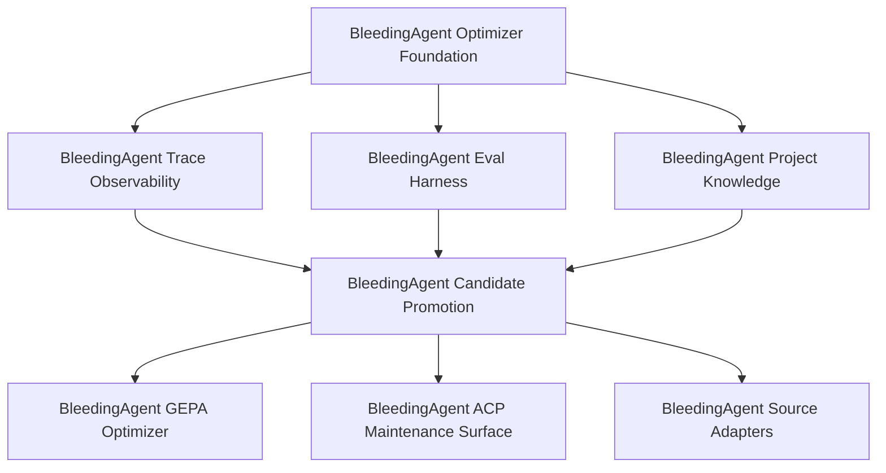

# BleedingAgent Optimizer DAG

Date: 2026-04-30

Source design document:

- `docs/bleeding-agent-rlm-optimizer-plan.md`

Plan corpus:

- `.codex/plans/bleeding-agent-foundation.plan.md`
- `.codex/plans/bleeding-agent-trace-observability.plan.md`
- `.codex/plans/bleeding-agent-eval-harness.plan.md`
- `.codex/plans/bleeding-agent-project-knowledge.plan.md`
- `.codex/plans/bleeding-agent-candidate-promotion.plan.md`
- `.codex/plans/bleeding-agent-gepa-optimizer.plan.md`
- `.codex/plans/bleeding-agent-acp-maintenance.plan.md`
- `.codex/plans/bleeding-agent-source-adapters.plan.md`

## Handoff State

- Graph ID: `bleeding-agent-acp-maintenance-plus-7-plans-c42d38614b`
- Selection hash: `c42d38614b`
- Plan set hash: `eb1f6619a6`
- Plan count: `8`
- Edge count: `9`
- Snapshot path: `.codex/plan-graphs/bleeding-agent-acp-maintenance-plus-7-plans-c42d38614b/snapshot.json`
- State dir: `.codex/plan-graphs/bleeding-agent-acp-maintenance-plus-7-plans-c42d38614b`

## Plan-Level DAG



## Current Frontier

Only one lane is currently launchable:

- `BleedingAgent Optimizer Foundation`
  - active: `foundation-types`
  - next: `foundation-registry`
  - next: `foundation-policy-resolver`

Blocked lanes:

- `BleedingAgent Trace Observability`
  - blocked by `bleeding-agent-foundation`
- `BleedingAgent Eval Harness`
  - blocked by `bleeding-agent-foundation`
- `BleedingAgent Project Knowledge`
  - blocked by `bleeding-agent-foundation`
- `BleedingAgent Candidate Promotion`
  - blocked by `bleeding-agent-trace-observability`, `bleeding-agent-eval-harness`, `bleeding-agent-project-knowledge`
- `BleedingAgent GEPA Optimizer`
  - blocked by `bleeding-agent-candidate-promotion`
- `BleedingAgent ACP Maintenance Surface`
  - blocked by `bleeding-agent-candidate-promotion`
- `BleedingAgent Source Adapters`
  - blocked by `bleeding-agent-candidate-promotion`

## Dependency Rationale

`BleedingAgent Optimizer Foundation` is the root because every later lane depends on stable schemas, profile resolution, canonical tool specs, rendered tool contracts, active policy selection, and ACP session pinning.

After foundation lands, three lanes can run in parallel:

- trace observability;
- eval harness;
- project knowledge.

Candidate promotion depends on all three because a candidate needs evidence, eval gates, and codebase knowledge separation before it can safely promote model/codebase profile changes.

GEPA, ACP maintenance controls, and source adapters are downstream. GEPA needs candidate infrastructure; ACP maintenance needs safe candidate/eval/promotion APIs; source adapters should wait until the canonical trace/eval/promotion path is stable.

## Rebuild Commands

```bash
python3 /Users/satan/side/experiments/skills/plan-graph/scripts/plan_graph.py validate \
  --plans-root ./.codex/plans \
  --glob 'bleeding-agent-*.plan.md' \
  --depends bleeding-agent-foundation:bleeding-agent-trace-observability \
  --depends bleeding-agent-foundation:bleeding-agent-eval-harness \
  --depends bleeding-agent-foundation:bleeding-agent-project-knowledge \
  --depends bleeding-agent-trace-observability:bleeding-agent-candidate-promotion \
  --depends bleeding-agent-eval-harness:bleeding-agent-candidate-promotion \
  --depends bleeding-agent-project-knowledge:bleeding-agent-candidate-promotion \
  --depends bleeding-agent-candidate-promotion:bleeding-agent-gepa-optimizer \
  --depends bleeding-agent-candidate-promotion:bleeding-agent-acp-maintenance \
  --depends bleeding-agent-candidate-promotion:bleeding-agent-source-adapters
```

```bash
python3 /Users/satan/side/experiments/skills/plan-graph/scripts/plan_graph.py frontier \
  --plans-root ./.codex/plans \
  --glob 'bleeding-agent-*.plan.md' \
  --depends bleeding-agent-foundation:bleeding-agent-trace-observability \
  --depends bleeding-agent-foundation:bleeding-agent-eval-harness \
  --depends bleeding-agent-foundation:bleeding-agent-project-knowledge \
  --depends bleeding-agent-trace-observability:bleeding-agent-candidate-promotion \
  --depends bleeding-agent-eval-harness:bleeding-agent-candidate-promotion \
  --depends bleeding-agent-project-knowledge:bleeding-agent-candidate-promotion \
  --depends bleeding-agent-candidate-promotion:bleeding-agent-gepa-optimizer \
  --depends bleeding-agent-candidate-promotion:bleeding-agent-acp-maintenance \
  --depends bleeding-agent-candidate-promotion:bleeding-agent-source-adapters \
  --lanes 8 \
  --max-depth 2
```
