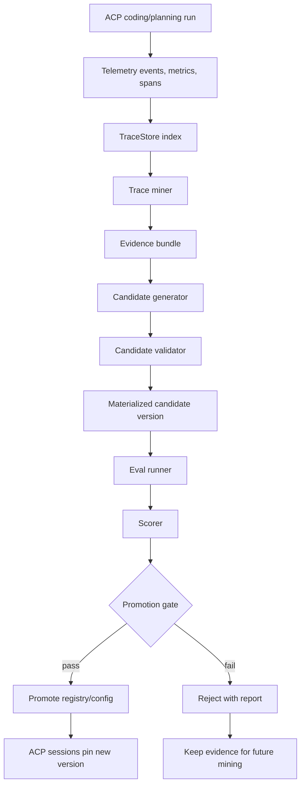
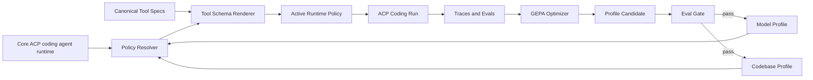

# BleedingAgent RLM Optimizer Plan

Date: 2026-04-30

## Executive Summary

BleedingAgent needs a trace-driven optimizer, not another standalone coding CLI. The useful shape is:

```text
ACP coding runs
  -> OpenInference/HALO-like spans
  -> bounded trace store and failure mining
  -> optimizer proposes prompt/tool/runtime/eval patches
  -> eval runner compares baseline vs candidate
  -> promotion writes versioned runtime artifacts or rejects
```

BleedingAgent is a full coding agent whose primary output and interaction surface is ACP, not a
custom terminal UI. ACP clients provide the chat/editor surface, named consumers such as Glass and
Zed are setup fixtures, and `bag` remains a provider/maintenance entrypoint. The optimizer should
live inside the BleedingAgent TypeScript codebase and run mostly in the background from real
coding-agent traces, with diagnostic controls available for us when we need to inspect or force a
run.

The first production-quality milestone is not “let an LLM rewrite the agent”. It is a disciplined versioned loop:

1. Registry for prompts, tool descriptions, routing policies, and eval cases.
2. Trace miner that turns runs into compact evidence bundles.
3. Candidate generator that proposes structured patches only against the registry.
4. Eval harness that rejects regressions automatically.
5. Promotion/rollback system with full traceable decisions.

Only after that should we add GEPA-first Ax/DSPy-style prompt evolution and optional HALO/Python interop. MiPROv2 remains a secondary option, not the default optimizer for this agent.

## What We Have Now

Existing useful pieces in this repo:

- `src/telemetry.ts`
  - Emits step, LLM, and tool-call metrics.
  - Writes HALO/OpenInference-shaped spans to `.bag/telemetry/spans.jsonl`.
  - Records tool failures, retry count, argument hashes, result sizes, error classes, duration, token counts, and model role.
- `src/trace-store.ts`
  - Builds `.bag/telemetry/spans.jsonl.index.jsonl`.
  - Supports overview, trace query/count, bounded trace view, selected span view, and in-trace search.
  - Rejects unbounded trace dumping by returning oversized summaries.
- `src/trace-analysis.ts`
  - Clusters repeated failures and latency patterns.
- `src/self-optimize.ts`
  - Produces self-optimization candidates from metrics and traces.
  - Writes safe artifacts like `.bag/tool-guidance.md` and `.bag/self-improvement-plan.md`.
- `src/acp-agent.ts`
  - ACP provider with `/traces`, `/metrics`, `/run`, `/plan`, `/chat`, `/auto`, `/yolo`, `/safe`, `/skills`, `/mcp`.
  - Default mode is auto, with YOLO enabled by default through config.

What is still missing:

- Prompt/tool description registry with stable IDs and hashes.
- Eval dataset with train/dev/test split.
- Candidate patches that can be applied to prompts/tool schemas/routing policies under version control.
- Baseline-vs-candidate evaluation runner.
- Promotion and rollback state machine.
- Model-driven trace investigator using trace tools.
- Ax optimizer integration over real examples and real metrics.
- Source adapters for non-span logs, such as historical Codex/Pi-style session logs.

## Research Takeaways

### HALO

HALO’s README defines the loop as trace collection, feeding OpenTelemetry-compatible traces into a HALO-RLM engine, decomposing common failures, producing a report, feeding that report into a coding agent, redeploying, and repeating. The important part is that HALO optimizes the harness, not the model weights or one answer.

The README also explains why a generic coding agent is the wrong tool for raw trace analysis: traces can get long, and generic agents overfit to one or a few trace errors instead of identifying systemic harness-level issues. That maps directly to our risk profile.

For BleedingAgent this means:

- Use bounded trace tools before asking a model to reason.
- Optimize recurring harness behavior: tool schemas, tool descriptions, routing, retries, context policy, evals.
- Never trust one failure trace as enough evidence for automatic promotion.
- Keep a holdout eval/test set to detect overfitting.

HALO’s AppWorld notes are also relevant: it found hallucinated tool calls, redundant tool arguments, refusal loops, and semantic correctness failures. These are exactly the classes we need to track for coding-agent behavior.

### HALO PR #31

HALO PR #31 is especially relevant because it tightens trace inspection:

- regex search over traces and spans;
- bounded match output with counts and `has_more`;
- `view_spans` oversized handling;
- raw JSONL sizing metadata;
- tool discipline: overview first, narrow indexed filters, search, then selected span reads.

Our `TraceStore` already has a simpler version of this. We should upgrade it toward the PR shape:

- regex search, not substring only;
- match context windows;
- `searchSpan(traceId, spanId, pattern)`;
- `rawJsonlBytes` on dataset and trace summaries;
- response byte budgets, not only character estimates;
- explicit `hasMore` and `returnedMatchCount`.

### HALO Issue #32

HALO issue #32 proposes source adapters for Pi session JSONL. The key architectural warning is: do not loosen the canonical span schema into a catch-all. Add an ingestion layer before the span index.

For us this matters because Codex/ACP sessions and historical local logs are high-value optimizer data. We should support adapters, but keep the canonical trace store strict:

```text
source logs
  -> source detector / explicit source type
  -> adapter
  -> canonical BleedingAgent span/event records
  -> existing trace index and optimizer tools
```

Default behavior must redact and bound private content. Full-content indexing should require explicit config.

### DSPy Optimizers

DSPy’s optimizer guidance is useful as process, even though BleedingAgent is TypeScript:

- few examples: bootstrap few-shot;
- more data: bootstrap with random search;
- trace-rich prompt evolution: GEPA;
- few-shot/example selection or simpler Bayesian prompt search: MiPROv2;
- prompt and weight optimization can be combined later.

GEPA should be the default direction for BleedingAgent because it reflects on structured execution trajectories, failures, tool outputs, parse errors, and textual feedback. That matches our traces much better than a scalar-only optimizer. MiPROv2 is still useful when we want joint instruction/demo optimization over a clean dataset, but it should not drive the main coding-agent self-improvement loop.

The main point: optimization requires examples, traces, textual feedback, and a metric. Blind prompt rewriting is not optimization.

### Ax

Ax is the right TypeScript-native foundation for this project. The Ax docs include unified optimization objects with score, instruction, demos, model config, optimizer type, and metadata. They also support checkpoint save/load functions for expensive optimization runs.

For BleedingAgent:

- Use GEPA-style reflective prompt evolution for structured prompt/program optimization once the eval pack exists.
- Use Ax's unified optimization artifact shape for persistence when using Ax-native optimizers.
- Persist optimizer output as versioned JSON artifacts.
- Checkpoint long optimization runs under `.bag/optimizer/checkpoints`.
- Keep Python optimization service optional. If a GEPA or MiPROv2 run requires Python-side tooling, it should be a sidecar optimization job, not a runtime dependency of the ACP coding agent.

### Compounding Engineering

The `Strategic-Automation/dspy-compounding-engineering` repo is useful as a learning-system reference, not as a runtime template. Its core loop is:

- plan;
- execute work;
- review/triage;
- codify learnings;
- auto-inject relevant learnings into future agent calls.

Useful pieces to adapt:

- project-local knowledge base under a hidden directory;
- automatic learning extraction after work/review/triage;
- de-duplication and consolidation before adding new learnings;
- KB auto-injection wrapper around agent calls;
- specialized review/evaluation agents;
- smart context gathering with semantic and keyword retrieval;
- work outcome codification even when a task fails.

Pieces not to copy directly:

- Python/DSPy runtime as our core implementation;
- custom CLI-first workflow;
- hand-authored model-specific prompt rules as the final mechanism.

For BleedingAgent this becomes two separate systems:

- **Project Knowledge**: codebase patterns, decisions, gotchas, commands, architecture, style.
- **Optimizer Profiles**: harness/tool-calling behavior tuned for a specific model and codebase.

Project knowledge improves task quality. Optimizer profiles improve agent reliability. They must be linked, but not mixed into one blob.

### ForgeCode Lessons

ForgeCode's GPT 5.4/Opus 4.6 writeup is the clearest warning for our architecture. They found that benchmark gains came from fixing model-specific agent-runtime failure modes:

- tool schema field ordering changed reliability;
- flatter schemas reduced malformed calls;
- explicit truncation reminders changed follow-up behavior;
- enforced verification mattered more than merely asking the model to verify;
- GPT 5.4 and Opus 4.6 needed different harness compensation even when they reached the same score.

For BleedingAgent this means:

- Tool schema shape is an optimization target.
- Tool result wording is an optimization target.
- Verification enforcement is an optimization target.
- Stop/continue policy is an optimization target.
- These optimizations are model-specific and likely codebase-specific.

The runtime must not hardcode “the best” schema/prompt globally. It must select a promoted profile for the active `(model, codebase, toolset)` tuple.

### OpenInference

OpenInference semantic conventions define `openinference.span.kind` values such as `LLM`, `TOOL`, `CHAIN`, `AGENT`, `EVALUATOR`, and `PROMPT`. BleedingAgent should align with those names instead of inventing another observability schema.

## Target Architecture

### Modules

Add an optimizer package under `src/optimizer/`:

```text
src/optimizer/
  types.ts
  registry.ts
  model-profile.ts
  codebase-profile.ts
  policy-resolver.ts
  tool-renderer.ts
  trace-miner.ts
  evidence-bundle.ts
  candidate-generator.ts
  candidate-validator.ts
  materialize-candidate.ts
  eval-case.ts
  eval-runner.ts
  scorer.ts
  promotion.ts
  report.ts
  ax-optimizer.ts
  source-adapters/
    spans-jsonl.ts
    codex-session-jsonl.ts
    acp-session-jsonl.ts
```

Keep existing `src/self-optimize.ts` as the current simple deterministic layer, then gradually move richer optimizer logic into `src/optimizer/`.

### Data Flow



### Model And Codebase Profile Layers

The central architectural requirement is separating optimizations from both the model and the codebase while still letting them compose at runtime.



#### Core Runtime

Invariant TypeScript code:

- ACP protocol handling;
- file editing mechanics;
- terminal/tool execution;
- telemetry;
- trace store;
- candidate validation;
- eval runner;
- promotion/rollback.

Core runtime should change rarely and only through normal source edits.

#### Model Profile

A model profile captures behavior needed for a specific model family or exact model build:

- `provider`;
- `model`;
- `modelVersion` when discoverable;
- `endpoint`;
- `toolCallingMode`;
- `contextWindow`;
- `quantization`;
- `serverRuntime`;
- `schemaRenderer`;
- `toolResultStyle`;
- `verificationPolicy`;
- `stopContinuePolicy`;
- `retryPolicy`;
- `truncationPolicy`;
- `knownFailureModes`;
- `evalStats`.

Example:

```json
{
  "id": "model.openai.gpt-5-4.default",
  "appliesTo": {
    "provider": "openai",
    "model": "gpt-5.4"
  },
  "toolSchema": {
    "requiredFieldOrder": "beforeProperties",
    "preferFlatObjects": true,
    "maxNestedObjectDepth": 1
  },
  "toolResults": {
    "truncationNotice": "inline-body-and-metadata",
    "mustRepeatPaginationInstruction": true
  },
  "verification": {
    "enforceBeforeFinish": true,
    "criticModelRole": "master"
  }
}
```

#### Codebase Profile

A codebase profile captures project-local behavior:

- repo fingerprint;
- framework/language/package manager;
- verification commands;
- formatting commands;
- test tiers;
- architectural patterns;
- common risky areas;
- preferred edit style;
- local MCP servers;
- local skills;
- project-specific evals;
- knowledge base pointer.

This is where compounding engineering belongs. It should learn from work outcomes, reviews, failures, and accepted user corrections.

#### Model-Codebase Policy

The active policy is the evaluated cross-product:

```text
core runtime
  + model profile
  + codebase profile
  + canonical tool specs
  + promoted model-codebase overrides
```

This is necessary because a prompt/tool setting can be good for `gpt-5.4` in one TypeScript monorepo and bad for a local Qwen MLX model in a smaller Rust project.

The policy ID must be recorded in every run:

- `inference.model_profile_id`;
- `inference.codebase_profile_id`;
- `inference.policy_id`;
- `tool.schema_renderer_version`;
- `tool.result_style_version`;
- `verification.policy_version`.

### Registry

Tool descriptions, prompts, routing policy, and eval cases must become versioned artifacts. Today too much behavior is embedded directly in source constants. That makes optimization and rollback harder.

Proposed artifact layout:

```text
.bag/optimizer/
  profiles/
    models/
      openai-gpt-5-4.v1.json
      anthropic-opus-4-6.v1.json
      local-qwen36-mlx.v1.json
    codebases/
      current.v1.json
    policies/
      model-codebase-policy.v1.json
  registry/
    prompts/
      route-prompt.v1.json
      coding-system.v1.json
      trace-investigator.v1.json
    tools/
      repo-read.v1.json
      repo-write.v1.json
      terminal-run.v1.json
      trace-search.v1.json
    policies/
      routing.v1.json
      context.v1.json
      retries.v1.json
    evals/
      golden.v1.jsonl
      dev.v1.jsonl
      holdout.v1.jsonl
  candidates/
    cand-2026-04-30T.../
      patch.json
      evidence.json
      eval-baseline.json
      eval-candidate.json
      decision.json
      report.md
  checkpoints/
  active.json
```

Every registry record needs:

- `id`;
- `kind`;
- `version`;
- `createdAt`;
- `source`;
- `content`;
- `contentHash`;
- `parentHash`;
- `status`: `active`, `candidate`, `rejected`, `retired`;
- `notes`;
- `linkedTraceIds`;
- `linkedEvalCaseIds`.

### Candidate Patch Types

Only allow structured patch types:

- `prompt.system`
- `prompt.instruction`
- `tool.description`
- `tool.schema`
- `tool.examples`
- `routing.policy`
- `context.policy`
- `retry.policy`
- `runtime.config`
- `eval.case`
- `source.adapter`
- `model.profile`
- `codebase.profile`
- `model-codebase.policy`
- `tool.schema-renderer`
- `tool.result-style`
- `verification.policy`

Do not allow arbitrary source edits in autonomous optimization. Source edits can happen through normal ACP coding tasks, but optimizer promotion should be artifact-driven first. This keeps the feedback loop simple and reversible.

### Canonical Tools And Model-Specific Rendering

Tool definitions should have two layers:

1. **Canonical Tool Spec**
   - semantic meaning;
   - TypeScript validation schema;
   - execution implementation;
   - safety rules;
   - deterministic result contract.

2. **Rendered Tool Contract**
   - model-specific JSON schema ordering;
   - flattening strategy;
   - examples;
   - description wording;
   - truncation/result wording;
   - retry and verification hints.

ForgeCode's schema-ordering and flattening examples show why this matters. The canonical tool remains the same, but the rendered schema can differ by model profile. GEPA should optimize the renderer/profile, not mutate the core tool implementation.

Example renderer knobs:

- `requiredFieldOrder`: `beforeProperties` or `afterProperties`;
- `maxNestedDepth`;
- `flattenSingleChildObjects`;
- `inlineExamples`;
- `argumentRepairHintStyle`;
- `truncationNoticeStyle`;
- `paginationInstructionStyle`;
- `verificationReminderStyle`;
- `toolNameStyle`;
- `descriptionVerbosity`.

Every tool call must record both:

- canonical tool version;
- rendered tool contract version.

Example patch:

```json
{
  "id": "cand-tool-repo-write-argument-discipline-001",
  "targets": [
    {
      "kind": "tool.description",
      "targetId": "repo-write",
      "baseHash": "sha256:...",
      "newContent": "Write a complete file replacement. Required: absolute or workspace-relative path, full content. Never pass a diff here."
    },
    {
      "kind": "eval.case",
      "targetId": "tool-argument-regression",
      "newContent": {
        "prompt": "Fix a one-line TypeScript type error in src/example.ts.",
        "expected": {
          "mustCallTools": ["repo.read", "repo.write", "terminal.run"],
          "mustNotCallTools": [],
          "assertions": ["file parses", "test passes"]
        }
      }
    }
  ],
  "evidence": {
    "traceIds": ["..."],
    "failureClusterIds": ["..."],
    "argumentHashes": ["..."]
  }
}
```

## Optimizer Levels

### L0: Deterministic Diagnostics

Status: mostly implemented.

Inputs:

- metrics;
- spans;
- trace analysis.

Outputs:

- failure clusters;
- latency clusters;
- safe config guidance;
- markdown report.

No model required.

### L1: Model-Assisted Evidence Review

Use master model or local model to inspect bounded evidence bundles and propose candidate patches. It cannot apply them.

Required tools:

- dataset overview;
- query traces;
- search trace;
- view selected spans;
- search span;
- view registry item;
- propose patch.

Output must be structured JSON validated by Zod.

### L2: Eval-Gated Artifact Promotion

Candidate patches are materialized into candidate registry state. Eval runner executes baseline and candidate. Promotion only happens if gates pass.

This is the first level that should write active runtime artifacts.

### L3: GEPA-First Prompt Evolution

Use GEPA-style reflective prompt evolution to optimize prompts against eval cases and trace feedback.

Good targets:

- routing prompt;
- trace-investigator prompt;
- coding system prompt;
- tool-use instruction blocks;
- summarization/compaction prompts;
- self-eval rubric.

Why GEPA first:

- coding-agent traces contain rich textual feedback, not just scalar rewards;
- failures include tool errors, parse errors, test output, diffs, and verification logs;
- Pareto selection fits our multi-objective scoring: correctness, edit validity, tool reliability, latency, and cost;
- the resulting prompt changes are inspectable as text and can be promoted through the registry.

Where MiPROv2 still fits:

- selecting or synthesizing few-shot demonstrations for stable modules;
- tuning a compact single-module classifier or router;
- comparing against GEPA as a baseline optimizer;
- combining optimized demos with GEPA-evolved instructions later.

Bad initial targets:

- unrestricted source code;
- file edit execution logic;
- terminal sandbox policy;
- MCP protocol behavior.

### L4: HALO-Style Multi-Agent Trace Investigator

Use a root investigator and bounded sub-investigators to analyze many trace clusters in parallel. This should still be ACP/internal, not a new primary CLI.

Only add this after trace tools are strong enough, otherwise subagents will waste context and overfit.

### L5: Online Bandit / Traffic Splitting

Later. Candidate versions can be assigned to a fraction of sessions. Promote based on live metrics. This is risky and needs stable evals first.

## Eval Harness

The eval harness is the core safety mechanism.

### Eval Case Types

1. `chat-no-side-effect`
   - Prompt: simple greeting or conceptual question.
   - Expected: no file reads, no terminal runs, no project scan.
   - This catches the Glass “Ahoj” failure.

2. `read-only-report`
   - Prompt: “vygeneruj report o stavu codebase”.
   - Expected: repo reads allowed, writes only if artifact requested or policy allows report artifact creation.
   - This prevents the bad “chat means no side effects” simplification.

3. `small-code-edit`
   - Prompt: fix a small typed bug.
   - Expected: reads target context, edits file, runs verification.

4. `verification-repair`
   - Seed a failing test after initial edit.
   - Expected: run test, inspect failure, repair once, rerun.

5. `tool-failure-recovery`
   - Simulate missing file, invalid args, timeout.
   - Expected: repair argument once for argument errors; do not blind-retry deterministic failures.

6. `routing-without-keyword-hardcoding`
   - Prompts in multiple languages and styles.
   - Expected: model-routed semantic decision, no brittle literal keyword table.

7. `safe-vs-yolo`
   - Verify YOLO default.
   - Verify safe mode asks for permission where ACP supports it.

8. `mcp-tooling`
   - Attach a mock MCP server.
   - Expected: discover/list/use tool; telemetry records namespace and schema version.

9. `large-trace-inspection`
   - Use oversized trace fixture.
   - Expected: overview -> query/search -> selected spans; never dump whole trace repeatedly.

10. `local-model-coding-quality`
   - Same coding tasks across local candidate models.
   - Expected: quality, latency, TTFT, token/s, edit validity, retry profile.

### Metrics

Hard metrics:

- task pass/fail;
- test command pass/fail;
- file edit validity;
- syntax/typecheck result;
- tool call failure rate;
- invalid tool argument rate;
- retry count;
- deterministic retry success rate;
- total duration;
- TTFT when streaming is available;
- prompt/completion tokens;
- context bytes;
- trace span count;
- LLM/tool p50/p95 latency;
- local model t/s;
- aggregate t/s under concurrency;
- diff size;
- reverted/rollback count.

Model-judge metrics are secondary:

- solution quality;
- plan coherence;
- minimality;
- codebase fit;
- risk awareness.

Do not let an LLM judge override deterministic failing tests.

### Split

Use three buckets:

- `train`: cases optimizer can inspect directly;
- `dev`: used for candidate selection;
- `holdout`: only used for promotion reports and regression detection.

Never include holdout traces in candidate prompts. Otherwise we will optimize to the benchmark, not the agent.

## Scoring

Candidate promotion should use a strict scorecard:

```text
promote if:
  hard_pass_rate_candidate >= hard_pass_rate_baseline
  and holdout_pass_rate_candidate >= holdout_pass_rate_baseline
  and tool_failure_rate_candidate <= baseline + tolerance
  and invalid_edit_rate_candidate <= baseline
  and p95_latency_candidate <= baseline * 1.15 unless quality improves materially
  and no critical regression cases fail
```

Recommended first weights:

- 45% hard correctness;
- 20% edit validity and verification behavior;
- 15% tool-call reliability;
- 10% latency/cost;
- 10% LLM judge quality.

Critical regressions should veto promotion regardless of aggregate score:

- edits when prompt should be chat only;
- refuses a valid coding task in YOLO/auto mode;
- writes outside allowed workspace;
- loses user files;
- fails to run verification for a code edit;
- fabricates tool results;
- repeats known invalid tool calls.

## ACP Product Surface

BleedingAgent is the coding agent. ACP is its primary product surface. The user-facing mental model should stay focused on coding-agent work:

- code;
- plan;
- report;
- inspect traces/metrics when debugging;
- configure safe/YOLO behavior;
- use attached MCP servers and skills.

Optimization should not be presented as a normal end-user workflow. It should run automatically after enough evidence is collected, on a schedule, or when we explicitly trigger a maintenance run. The agent can mention optimization only when it matters to the current coding work, for example:

- a promoted policy changed current behavior;
- a regression was detected and rolled back;
- the user asks for diagnostics;
- a coding task failed and the agent points to the trace/eval evidence.

Diagnostic ACP commands can exist, but they should be hidden, namespaced, or marked as maintenance so they do not confuse ordinary users:

- `/traces`
  - current overview and failing trace IDs.
- `/evals`
  - list eval packs and last result summary.
- `/maintenance optimize`
  - run deterministic trace mining and create candidate proposals.
- `/maintenance optimize inspect <candidate>`
  - show report and linked evidence.
- `/maintenance optimize eval <candidate>`
  - run baseline/candidate comparison.
- `/maintenance optimize promote <candidate>`
  - promote only if eval gate passes.
- `/maintenance optimize rollback`
  - restore previous active registry/config.

The `bag` binary can also support maintenance commands for automation:

- `bag acp`
- `bag self-optimize`
- `bag eval`
- `bag optimize --propose`
- `bag optimize --eval <candidate>`

The product workflow is ACP via any compatible client. The distinction is not “coding agent vs
ACP”; it is “coding agent core with ACP UI” vs “custom CLI chat UI”. We want the former.

## Source Adapters

We should add source adapters after the core eval gate works.

Initial adapters:

- `spans-jsonl`
  - current native path.
- `codex-session-jsonl`
  - historical local agent logs if available and safe.
- `acp-session-jsonl`
  - ACP session transcripts when a compatible client exposes them, including Glass/Zed where
    validated.
- `pi-session-jsonl`
  - optional, inspired by HALO issue #32.

Adapter rules:

- detect source explicitly or fail closed;
- preserve lineage;
- preserve roles, tool calls, tool results, errors, model changes, compactions;
- redact by default;
- cap excerpts;
- stream large directories;
- output canonical span/event records;
- do not weaken the native span schema.

## Trace Tool Improvements Needed

Upgrade `src/trace-store.ts`:

- Add regex search with safe timeout or complexity limits.
- Add `searchSpan(traceId, spanId, pattern)`.
- Add match context windows.
- Add `rawJsonlBytes` to overview and summaries.
- Add `returnedMatchCount` and `hasMore`.
- Add noisy OpenInference flat projection dropping, similar to HALO, for huge `llm.input_messages.<i>.*` fanout.
- Add response byte budgets to `viewSpans`.
- Add trace index invalidation using source size plus high-resolution mtime where available.
- Add corruption stats: ignored lines, parse errors, invalid schema rows.

This matters because the optimizer model will be only as good as its trace access discipline.

## Prompt And Tool Registry

Current problem:

- ACP routing text, command descriptions, and tool behavior are partly embedded in source.
- A self-optimizer cannot safely propose changes to those pieces without source edits.
- We cannot compare versions cleanly.

Target:

- Move behavior text into registry artifacts loaded at startup.
- Keep TypeScript source as the hard protocol/runtime layer.
- Use hashes to pin a session to the registry version it started with.
- Record prompt/tool version hashes in every span.

Each tool call span should include:

- `inference.model_profile_id`;
- `inference.codebase_profile_id`;
- `inference.policy_id`;
- `tool.name`;
- `tool.namespace`;
- `tool.description_version`;
- `tool.schema_version`;
- `tool.schema_renderer_version`;
- `tool.result_style_version`;
- `tool.prompt_hash`;
- `tool.argument_hash`;
- `tool.result_kind`;
- `tool.retry_count`;
- `tool.error_class`;
- `tool.error_stage`: `model_argument`, `validation`, `execution`, `timeout`, `permission`, `transport`, `unknown`.

## Candidate Generator

Input:

- failure clusters;
- trace IDs;
- selected span excerpts;
- baseline registry versions;
- current eval results.

Output:

- structured candidate patch;
- rationale;
- linked evidence;
- expected metric movement;
- eval cases to run or add;
- rollback risk.

Validation:

- Zod schema validation;
- target exists;
- base hash matches;
- patch type is allowed;
- no source edit unless explicitly invoked as ACP coding task;
- no secrets in patch;
- eval gate exists;
- max patch size enforced.

The model should not get raw full traces by default. It should get evidence bundles and call trace tools when more detail is needed.

## Ax Integration Strategy

Use Ax in phases.

### Phase A: Manual Candidate Evaluation

No Ax optimizer yet. Candidate generator proposes one or a few patches. Eval runner scores them.

### Phase B: Bootstrap Few-Shot

Use successful historical runs as examples for:

- routing;
- tool argument repair;
- trace failure classification;
- report generation;
- planning vs coding selection.

### Phase C: GEPA Prompt Evolution

Use GEPA-style optimization for:

- routing prompt;
- coding prompt;
- trace investigator prompt;
- self-eval rubric.

GEPA input should include:

- eval case input/output;
- execution trace summary;
- failed tool-call arguments and error messages;
- test/typecheck output;
- deterministic assertion failures;
- LLM judge critique only after deterministic checks.

### Phase D: MiPROv2 / Few-Shot Baseline

Use MiPROv2 when we specifically want joint instruction and demonstration optimization for a stable module, or when we need a baseline against GEPA. Keep Python-side optimizer dependencies optional and checkpointed.

## Implementation Plan

### Phase 1: Registry And Version Pinning

Files:

- `src/optimizer/types.ts`
- `src/optimizer/registry.ts`
- `src/optimizer/model-profile.ts`
- `src/optimizer/codebase-profile.ts`
- `src/optimizer/policy-resolver.ts`
- `src/optimizer/tool-renderer.ts`
- `src/optimizer/promotion.ts`
- tests in `tests/bag.test.ts` or split into `tests/optimizer.test.ts`

Tasks:

- Define registry schemas with Zod.
- Define model profile, codebase profile, and model-codebase policy schemas.
- Define canonical tool spec and rendered tool contract schemas.
- Load active registry from `.bag/optimizer/active.json`.
- Resolve active policy from `(current model, current codebase, canonical toolset)`.
- Seed default registry from source constants if no artifact exists.
- Render tool contracts from canonical specs plus active policy.
- Record active prompt/tool/profile/policy versions in telemetry.
- Pin ACP session to active registry version at session creation.

Gotchas:

- Do not break existing default startup when `.bag/optimizer` does not exist.
- Avoid writing `.bag` during read-only initialization.
- Existing tests should not depend on wall-clock candidate IDs.
- Profile resolution must fail closed to a conservative default, never to a half-applied candidate.
- A session must stay pinned to its policy even if a background optimizer promotes a new one.

### Phase 2: Evidence Bundle

Files:

- `src/optimizer/trace-miner.ts`
- `src/optimizer/evidence-bundle.ts`
- `src/trace-store.ts` upgrades

Tasks:

- Convert failure clusters into bounded evidence bundles.
- Include trace IDs, span IDs, error messages, argument hashes, model names, durations, and excerpts.
- Include model profile ID, codebase profile ID, policy ID, tool renderer version, and verification policy version.
- Produce contrast bundles across models when the same eval case fails differently.
- Add corruption and truncation metadata.
- Add regex/search-span support.

Gotchas:

- Regex can become expensive. Add max pattern length, max matches, and ideally timeout/cancellation.
- Never expose full prompt/tool outputs by default.
- Evidence should be deterministic so candidates are reproducible.

### Phase 3: Eval Harness

Files:

- `src/optimizer/eval-case.ts`
- `src/optimizer/eval-runner.ts`
- `src/optimizer/scorer.ts`
- `tests/evals/*.jsonl`

Tasks:

- Define eval case schema.
- Add fixture workspaces for small coding tasks.
- Add model-profile eval dimensions: schema shape, result wording, verification enforcement, truncation handling.
- Add codebase-profile eval dimensions: repo conventions, project commands, framework-specific file edits.
- Capture tool/LLM traces per eval.
- Compare baseline and candidate.
- Produce `eval-baseline.json`, `eval-candidate.json`, and markdown report.

Gotchas:

- Eval workspaces must be temporary copies, never the real repo.
- Terminal commands need timeouts.
- Local model concurrency makes results flaky; record seed/config and run enough repetitions for noisy cases.
- Do not use LLM judge for deterministic correctness.
- Never compare two profile candidates across different model server configs.

### Phase 4: Candidate Generator

Files:

- `src/optimizer/candidate-generator.ts`
- `src/optimizer/candidate-validator.ts`
- `src/optimizer/materialize-candidate.ts`

Tasks:

- Ask master model to propose structured patches from evidence bundles.
- Optionally ask local model for cheaper first-pass candidates.
- Prefer GEPA-style reflective mutation over MiPROv2-style broad prompt/demo search for harness behavior.
- Generate profile patches against model profile, codebase profile, or model-codebase policy.
- Validate and materialize candidates.
- Link candidates to eval gates.

Gotchas:

- Candidate generator can hallucinate target IDs. Reject.
- It can suggest huge rewrites. Cap patch size.
- It can encode benchmark-specific hacks. Use holdout and patch review text.
- It can leak secrets from traces. Redact before prompt and scan output.
- It can conflate model quirks with project quirks. Require candidates to declare their intended scope: global, model, codebase, or model-codebase.

### Phase 5: ACP Maintenance And Background Optimization

Files:

- `src/acp-agent.ts`
- `src/index.ts`

Tasks:

- Add automatic post-run optimization triggers with conservative thresholds.
- Add scheduled/background optimization entrypoints for maintenance runs.
- Add `/evals` for diagnostics.
- Add hidden or maintenance-scoped optimizer commands:
  - `/maintenance optimize`;
  - `/maintenance optimize inspect`;
  - `/maintenance optimize eval`;
  - `/maintenance optimize promote`;
  - `/maintenance optimize rollback`.

Gotchas:

- Long eval runs need cancellation support.
- ACP UI should show coding-agent plan entries and tool calls clearly; optimizer internals should not dominate normal coding sessions.
- Session should return to previous mode after a temporary optimizer command if it started in auto.

### Phase 6: GEPA-First Optimizer

Files:

- `src/optimizer/ax-optimizer.ts`

Tasks:

- Wrap selected registry prompts as Ax programs.
- Build examples from eval cases and successful traces.
- Feed GEPA textual feedback from trace summaries, tool failures, test output, and evaluator critiques.
- Use GEPA to evolve model/codebase profile patches, not only raw prompt strings.
- Maintain a Pareto front per `(modelProfileId, codebaseProfileId, evalPackId)`.
- Use checkpoint save/load under `.bag/optimizer/checkpoints`.
- Save unified optimized output as registry candidate, not directly active state.
- Run MiPROv2 only as a baseline or for few-shot demonstration selection.

Gotchas:

- Optimization can be expensive and slow.
- Small datasets overfit easily.
- GEPA can overfit textual feedback if the feedback includes hidden eval-specific details.
- Pareto fronts need an explicit promotion policy; the highest correctness candidate may not be the best latency/reliability tradeoff.
- Python-side optimizer dependencies must stay optional.
- Make optimizer runs resumable.

### Phase 7: Source Adapters

Files:

- `src/optimizer/source-adapters/*`

Tasks:

- Add native span adapter.
- Add ACP/Codex session adapter after schema inspection.
- Add redaction controls.
- Add tests with synthetic JSONL.

Gotchas:

- Historical logs can contain secrets.
- Thinking/private reasoning blocks should not be indexed verbatim.
- Directory ingestion must stream.
- Adapter failure should be explicit, not silently ignored.

## Main Gotchas And Failure Modes

### Model/Profile Leakage

The optimizer may learn a fix for one model and accidentally apply it to all models.

Mitigation:

- every candidate declares scope: global, model, codebase, or model-codebase;
- promotion gates run at the same scope;
- global promotion requires cross-model evidence;
- model-specific profile patches never mutate canonical tool specs directly.

### Codebase Overfitting

A policy can become excellent for one repository and worse elsewhere.

Mitigation:

- keep project knowledge in codebase profiles;
- keep model quirks in model profiles;
- use project-local evals for codebase promotion;
- require separate promotion before a codebase policy becomes global.

### Knowledge vs Optimizer Confusion

Project knowledge and harness optimization look similar, but they serve different goals.

Mitigation:

- knowledge entries say what is true about the codebase;
- optimizer profile entries say how the agent should operate;
- both are cited in traces separately;
- GEPA can use knowledge as feedback, but candidate patches target profiles/registry records.

### Overfitting

HALO explicitly exists because generic agents overfit trace analysis. Our optimizer must require repeated evidence or eval proof.

Mitigation:

- train/dev/holdout split;
- minimum sample count before auto-promotion;
- one-off failures can create eval suggestions, not active changes;
- promotion report must show before/after metrics.

### Bad Evaluator

If the eval harness rewards the wrong thing, optimization will make the agent worse.

Mitigation:

- deterministic checks first;
- LLM judge second;
- critical veto cases;
- fixture workspaces with actual tests/typechecks.

### Tool Schema Drift

Changing a tool description or schema can break ACP/client expectations.

Mitigation:

- version every schema;
- validate before runtime;
- record schema version in spans;
- keep runtime protocol stable.

### Trace Privacy

Tool args/results, prompts, and code can contain secrets.

Mitigation:

- redaction pass before evidence bundles;
- capped excerpts;
- opt-in full-content indexing;
- output scan before writing candidate reports.

### Context Explosion

Trace analysis fails if the optimizer dumps huge traces into prompts.

Mitigation:

- overview first;
- indexed filters;
- regex search;
- selected span reads;
- byte budgets;
- noisy projection dropping.

### Streaming Retry Duplicates

Streaming LLM failures can occur after partial output. Retrying mid-stream can duplicate tool calls or messages.

Mitigation:

- classify pre-stream vs mid-stream failures;
- retry only before any externally visible effect;
- record stream phase in telemetry.

### Runtime Race

An optimizer might promote a new registry while an ACP session is running.

Mitigation:

- pin session to registry hash at session creation;
- new versions apply to new sessions;
- explicit “reload policy” command if needed.

### Local Model Flakiness

Local models can change quality under concurrency, context length, memory pressure, or server configuration.

Mitigation:

- record model, endpoint, quant, context, concurrency, TTFT, t/s;
- repeat noisy evals;
- separate interactive and batch profiles;
- do not compare candidate A/B across different server configs.

### Prompt Patch Abuse

A model can “fix” an eval by adding brittle benchmark text.

Mitigation:

- patch linter detects direct mentions of hidden eval IDs or expected answers;
- holdout tests;
- human-readable report;
- reject changes that reduce generality.

### Artifact Churn

Optimizer can create many noisy candidates and reports.

Mitigation:

- candidate retention policy;
- compress old trace artifacts;
- summarize rejected candidates;
- keep full JSON only for promoted and high-value rejected runs.

## Recommended Next Implementation Slice

Build the loop in this order:

1. Add optimizer registry, model profile, codebase profile, canonical tool spec, rendered tool contract, and active policy resolution.
2. Record model/codebase/policy/tool-renderer versions in every trace.
3. Upgrade trace search to HALO PR #31-style bounded regex/search-span behavior.
4. Add the golden eval pack for routing, no-side-effect chat, report generation, small edit, verification repair, tool failure recovery, truncation behavior, and schema-shape reliability.
5. Add candidate generator that only writes structured profile/registry artifacts.
6. Add candidate eval and promotion/rollback scoped to global/model/codebase/model-codebase.
7. Add GEPA-first optimization once the eval pack is real.

Do not start by importing the HALO Python engine as the main path. The better design is TS-native with optional HALO-compatible adapters and export/import.

## Source Links

- HALO repository and README: https://github.com/context-labs/HALO
- HALO PR #31, bounded trace search/view improvements: https://github.com/context-labs/HALO/pull/31
- HALO issue #32, source adapter boundary for session JSONL: https://github.com/context-labs/HALO/issues/32
- DSPy optimizer documentation: https://dspy.ai/learn/optimization/optimizers/
- Ax optimization guide: https://axllm.dev/optimize/
- Ax repository: https://github.com/ax-llm/ax
- OpenInference semantic conventions: https://arize-ai.github.io/openinference/spec/semantic_conventions.html
- Strategic Automation DSPy Compounding Engineering: https://github.com/Strategic-Automation/dspy-compounding-engineering
- Compounding Engineering architecture docs: https://strategic-automation.github.io/dspy-compounding-engineering/concepts/architecture/
- Compounding Engineering knowledge base docs: https://strategic-automation.github.io/dspy-compounding-engineering/concepts/knowledge-base/
- ForgeCode GPT 5.4 agent improvements: https://forgecode.dev/blog/gpt-5-4-agent-improvements/
